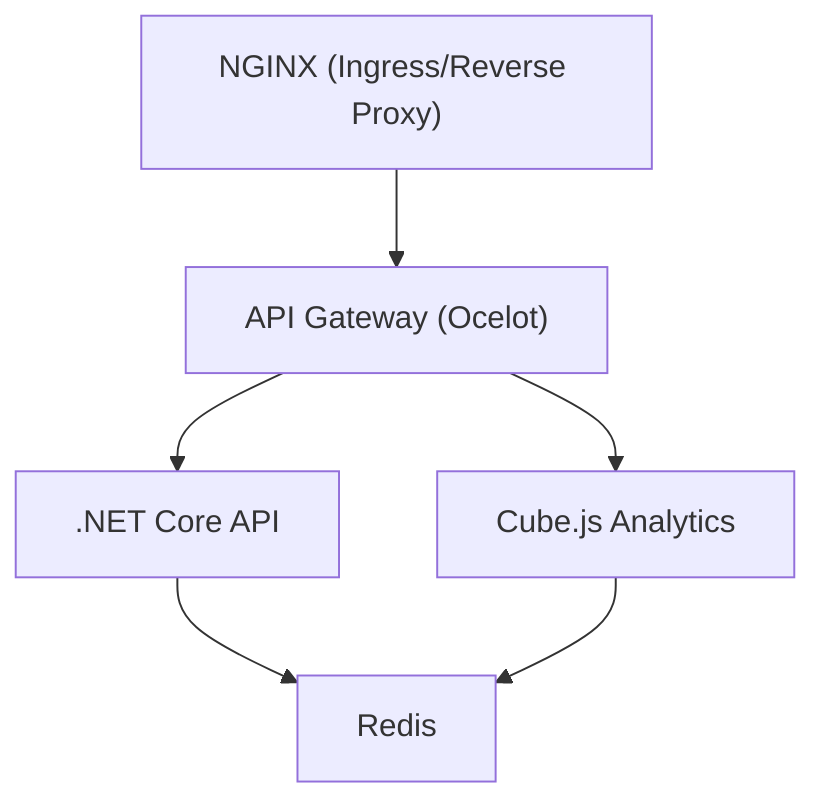

# 🚀 Full CI/CD DevSecOps Template for Dockerized Microservices

A complete production-grade template to build, scan, test, and deploy a microservices architecture using Docker Compose, Jenkins, SonarQube, OWASP Dependency-Check, Trivy, and Kubernetes — topped with automated CI/CD workflows.

This project mirrors a real-world enterprise environment with NGINX, .NET Core APIs, Redis, Cube.js analytics engine, and API Gateway services.

---

## ✨ Features

- 🐳 Docker Compose setup with microservices (`nginx`, `.NET Core APIs`, `Cube.js`, `Redis`)
- ☸️ Kubernetes manifests for all services (see `k8s/`)
- 🔐 Security Scanning with:
  - [Trivy](https://github.com/aquasecurity/trivy) - Image & config vulnerabilities
  - [OWASP Dependency-Check](https://owasp.org/www-project-dependency-check/) - Dependency vulnerabilities
- 📊 Code Quality & Coverage with:
  - [SonarQube](https://www.sonarsource.com/products/sonarqube/)
- ⚙️ CI/CD Automation with:
  - Jenkins pipeline (`Jenkinsfile`) to:
    - Lint + Build Docker images
    - Run security scans
    - Push to Docker Registry
    - Deploy via `docker-compose` or Kubernetes
- 📁 Organized Service Volumes & Configuration
- 🌍 Ready-to-deploy on any Linux server or Kubernetes cluster

---

## 🛠️ Stack

| Tool | Purpose |
|------|---------|
| Docker Compose | Local orchestration |
| Kubernetes | Container orchestration |
| Jenkins | CI/CD pipeline |
| SonarQube | Static code analysis |
| Trivy | Docker image vulnerability scan |
| OWASP DC | Dependency security scan |
| NGINX | Reverse proxy |
| .NET Core | API backend |
| Redis | In-memory DB |
| Cube.js | Analytics & dashboard backend |

---

## 🗺️ Architecture Diagram



---

## 📃 API Documentation

- The .NET Core API exposes OpenAPI/Swagger docs at `/swagger` when running locally or in a container.
- You can view and test endpoints interactively via the Swagger UI.
- For more details, see the `api/` service folder.

---

## 🧠 Common Questions

1. **How do I run the application locally?**
   ```sh
   docker-compose up --build
   ```

2. **How do I run the application in Kubernetes?**
   ```sh
   kubectl apply -k k8s/
   ```

3. **How do I access the Swagger UI?**
   - NGINX is exposed as a NodePort (ports 30080/30443 by default).
   - Access `http://<your-node-ip>:30080/swagger` or `https://<your-node-ip>:30443/swagger`

---

## ☸️ Kubernetes Quick Start

1. **Prerequisites:**
   - Kubernetes cluster (local: [minikube](https://minikube.sigs.k8s.io/), [kind](https://kind.sigs.k8s.io/), or cloud)
   - `kubectl` installed

2. **Apply all manifests:**
   ```sh
   kubectl apply -k k8s/
   ```

3. **Expose NGINX:**
   - NGINX is exposed as a NodePort (ports 30080/30443 by default).
   - Update `k8s/nginx-deployment.yaml` for Ingress if needed.

4. **Config & Secrets:**
   - Create ConfigMaps for NGINX configs and a Secret for SSL certs:
     ```sh
     kubectl create configmap nginx-config --from-file=nginx/nginx.conf
     kubectl create configmap nginx-proxy --from-file=nginx/proxy.conf
     kubectl create configmap nginx-mime --from-file=nginx/mime.types
     kubectl create secret generic nginx-ssl --from-file=nginx/ssl/
     ```

5. **Health Checks:**
   - All services have liveness/readiness probes (e.g., `/healthz`, `/readyz`).

6. **Scaling:**
   - Adjust `replicas` in the deployment YAMLs or use `kubectl scale`.

---

## 🩺 Health Checks
- **NGINX:** `/healthz` (HTTP/HTTPS)
- **API & Gateway:** `/healthz` (HTTP)
- **Cube.js:** `/readyz` (HTTP)
- **Redis:** TCP socket probe

---

## 📈 Scaling
- Use the `replicas` field in each deployment YAML or scale dynamically:
  ```sh
  kubectl scale deployment api --replicas=5
  ```

---

## 📂 See Also
- [Kubernetes Documentation](https://kubernetes.io/docs/)
- [Docker Compose](https://docs.docker.com/compose/)
- [Jenkins](https://www.jenkins.io/)

---

## 📣 Contributions
PRs and issues welcome! See the [LICENSE](LICENSE) for details.